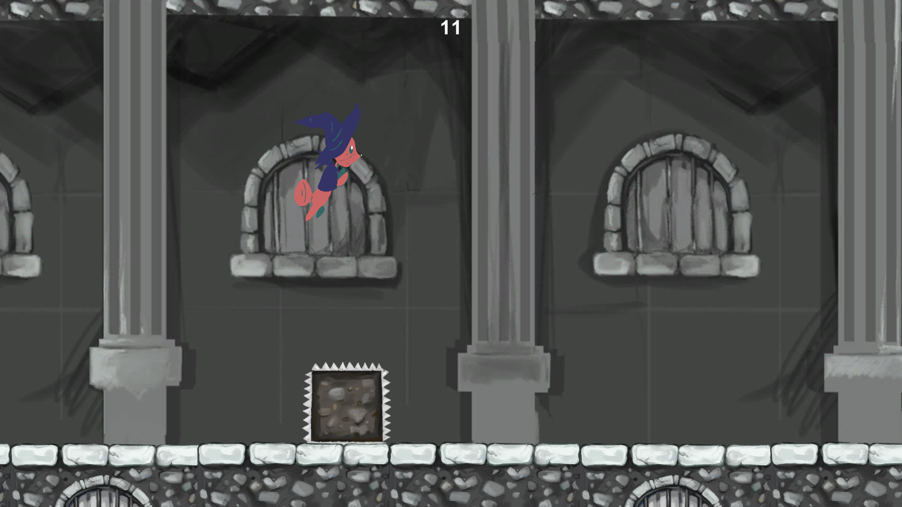

# Micro Game Jam - Endless-Runner

A simple endless runner for a first micro jam

<h2 align="center">https://abeer7.itch.io/castle-run</h2>

  
  

  
  

## Credits:

### Art:
- Character: 
 Hussien Hegazy: https://www.behance.net/hussienhege932?fbclid=IwAR2y7IEePitZ7aUzZMkBfjDX4EQfWt776N31n1e5KLzWLXN7VFM2VER1caY

- Environment:
 Rana El-Shafei: https://www.facebook.com/rana.elshafei.1

### Audio:
- Music: https://incompetech.com/music/royalty-free/full_list.php
- SFX: https://freesound.org/
